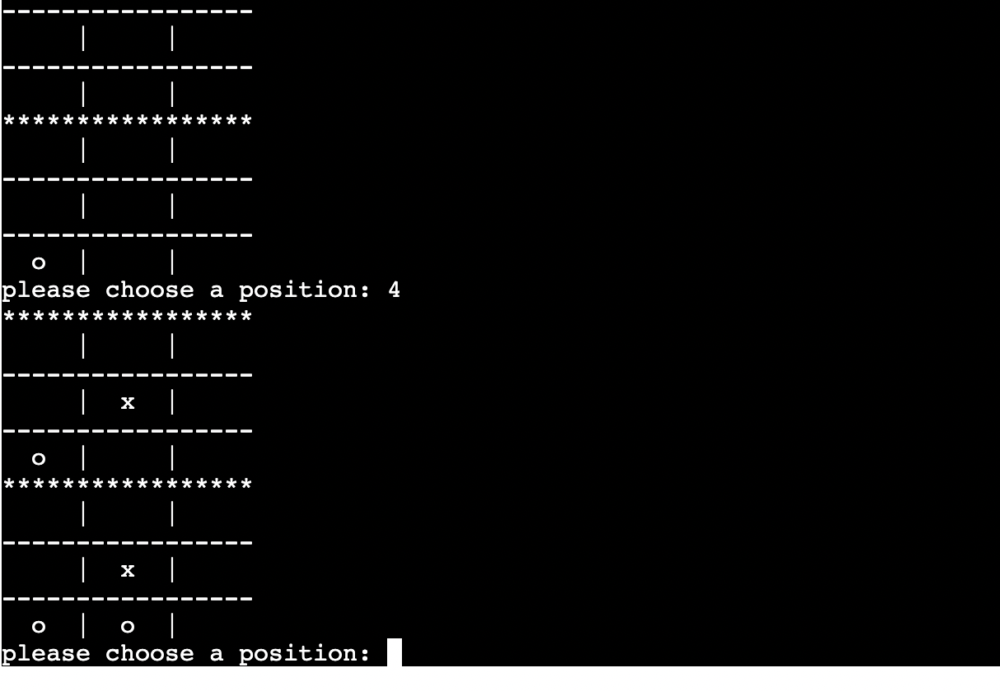

# Tic_Tac_Toe
Welcome to my page ...Enjoy playing this fun game..Its is designed one page game using Python Language.
Tic Tac Toe is one of my favourite games that is why I wanted to build it in one of the most popular language(Python).
[view the game on heroku](https://my-tic-tac-toe-2021.herokuapp.com/)

# Strategy plan
Tic Tac Toe planned to be fun game for a short time, suitable for everyone.
# Goals
* To provide users with fun , simple game.
* To provide an online Tic Tac Toe to play.
* To challenge myself against Computer.
* as a user I would like to know if there a free position, and support it with an appropriate message.
* as a user I would like to be notified if I put a numer that is not how the game asked or put a symble that is not a number.
* as user I want to have fun and positive experience.
# Game Features
* Game Instruction, as is the very important to run any game to have a clear instructions for the palyer.

* Board orgnised places as the player will choose the position.

* Playes against the computer, Computer would choose randomaly position between 0-8 .

* player will keep choosing the positions he/she wants on board untill either he/she wins or the computer.
* It shows at the end of each game ,who won.

* If none wins, then it will show Draw!

* If there is a winner or Draw! , the game will end , and the player needs to run the game again for keep playing.

# Testing 
The game been tested manually on PEP8 and confirmed , there is no problem.

# Technologies
* GitHub, used for project control.
* Gitpod, used for making the project.
* Heroku, used for Deployment.

# Bugs
* When I was writing the code I was getting problems with spacing. I fixed that by reading about spaces between python lines and slacks colleagues .

# Remaining Bugs
* No Bugs Remained.

# Project Deployment
* Sign up/ login to [heroku](https://id.heroku.com/login).
* Set the buildbacks to Python and NodeJs.
* Link Heroku app to repositry.
* click Deploy.

# Future Enhancement
* players Scores.
* Difficulty Levels.

# Credit 
* Code institute for the deployment terminal.
* Youtube tutorials.
* [W3Schools](https://www.w3schools.com/) web used to read bout functions.

# Aknowledge
## I would like to Thank the following :
* Code Institute Team, and my Mentor Antonio Rodriguez.
* Dave Horrocks helps me to understand Python better and was supporting me in my project by giving the right steps and advises.

